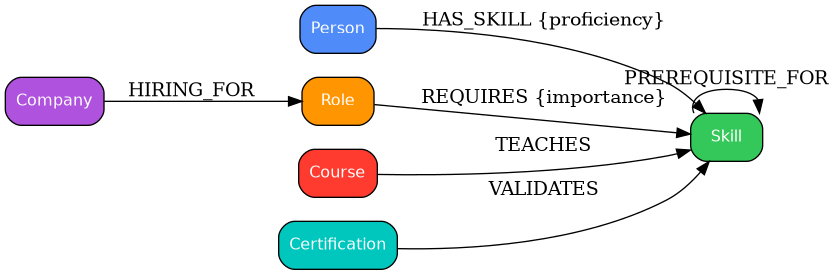

# Career Pathway Graph

Career Pathway Graph is a graph-based application designed to help users explore how skills, roles, companies, courses, and certifications are connected. Rather than treating career growth as a set of isolated records, the project models it as a network of relationships and uses that structure to surface practical insights.

The application was built for the Wexa AI take-home assignment and uses CognoDB as the graph database layer.



---

## Overview

The idea behind this project is simple: career development is rarely linear. A person may be strong in one area, need to bridge a skill gap to reach a new role, and benefit from a learning path that connects multiple concepts. This app makes those connections visible.

Users can:

- explore their current skill profile against target roles
- identify missing skills for a role
- discover a learning path through prerequisite relationships
- view courses that can help close important gaps
- understand which skills are most in demand across hiring companies

---

## Why a graph database?

A career pathway is fundamentally a network of relationships, not a flat table. Graph databases are especially well-suited for this use case because they make it natural to model and query connections such as:

- skills that unlock other skills
- a person’s current capabilities compared with the needs of a role
- company hiring patterns across roles and required skills
- course recommendations based on related knowledge areas

In a relational model, these questions often require several joins and more complex logic. In a graph model, they are expressed more directly and are easier to reason about.

---

## Data model

The application uses a simple but expressive graph model built from the following node types:

- Person
- Skill
- Role
- Company
- Course
- Certification

The main relationships include:

- HAS_SKILL: Person → Skill, with a proficiency property
- REQUIRES: Role → Skill, with an importance property
- PREREQUISITE_FOR: Skill → Skill
- HIRING_FOR: Company → Role
- TEACHES: Course → Skill
- VALIDATES: Certification → Skill

The diagram shown above was generated from the project’s documentation assets in the docs folder.

---

## Project structure

```text
career-graph/
├── app.py                # Streamlit user interface
├── db.py                 # CognoDB connection handling and error handling
├── queries.py            # Parameterized Cypher queries
├── seed_data.py          # Seed script for loading sample graph data
├── requirements.txt      # Python dependencies
├── .env.example          # Environment variable template
├── render.yaml           # Render deployment configuration
├── runtime.txt           # Python runtime pin
└── docs/                 # Data model assets and diagram script
```

---

## Setup and run locally

### 1. Create a CognoDB instance

1. Sign up at https://console.cognodb.com/signup
2. Create a free c0 instance
3. Copy the bolt+s:// connection URI and the generated password for the cognodb user

### 2. Configure environment variables

Create a .env file from the example template:

```bash
copy .env.example .env
```

Then update the file with your actual values:

```env
COGNODB_URI=bolt+s://<instance-id>.databases.cognodb.cloud
COGNODB_USER=cognodb
COGNODB_PASSWORD=<your-password>
```

### 3. Install dependencies

```bash
python -m venv venv
venv\Scripts\activate
pip install -r requirements.txt
```

### 4. Load sample data

```bash
python seed_data.py
```

This script loads a realistic set of nodes and relationships into the graph database so the app can be explored immediately.

### 5. Start the application

```bash
streamlit run app.py
```

The app should open locally at http://localhost:8501.

---

## Core features

The application uses parameterized Cypher queries in queries.py to support the following experiences:

1. Skill gap analysis
   - compares a person’s current skills with the skills required for a target role
2. Learning path exploration
   - finds a multi-hop path between related skills through prerequisite relationships
3. Course recommendations
   - suggests courses that help close missing skills
4. Market demand insights
   - highlights the skills most frequently associated with hiring companies

---

## Error handling and resilience

The application is designed to handle connection issues gracefully. If CognoDB is unavailable or the credentials are incorrect, the app presents a clear fallback experience rather than failing abruptly.

---

## Demo and deployment

The project is ready to be run locally and can also be deployed to a hosting service such as Render for a public demo.

Local demo: http://localhost:8501

---

## Technology stack

- Database: CognoDB
- Driver: official Neo4j Python driver
- UI: Streamlit
- Data loading: Python

---

## Notes

This project is intentionally small and focused, but it demonstrates how graph data modeling can be applied to a real-world problem in a way that is both practical and easy to understand.
